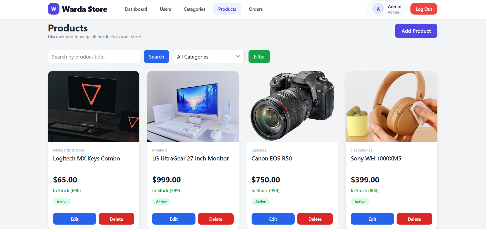
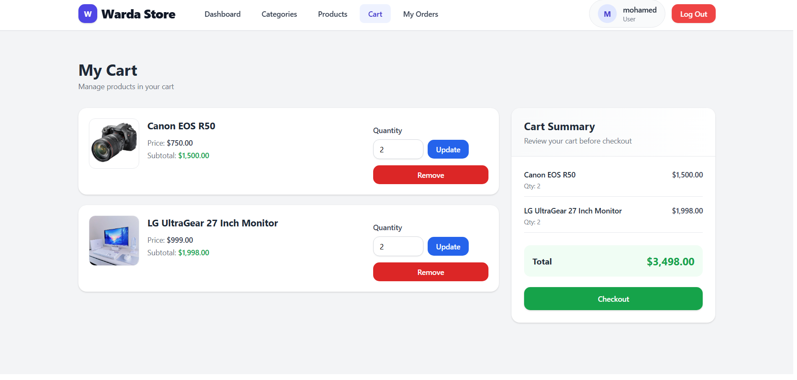
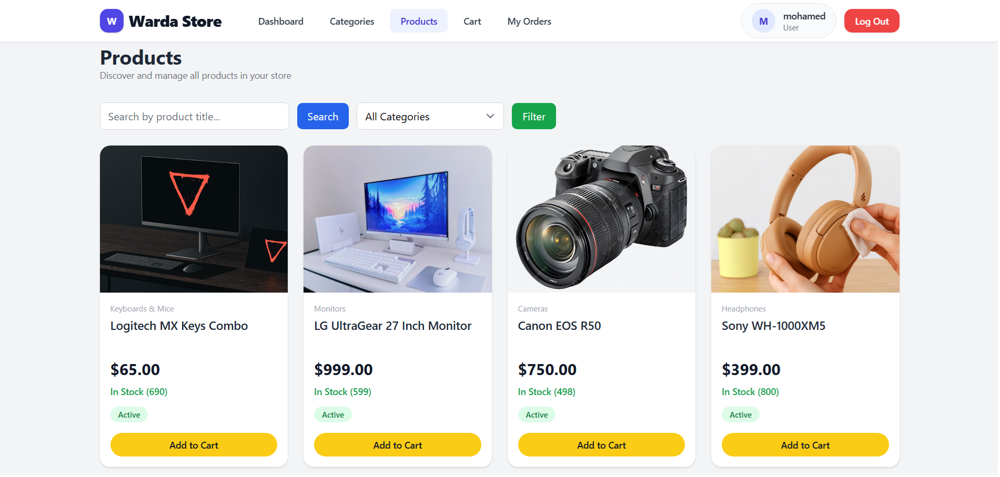
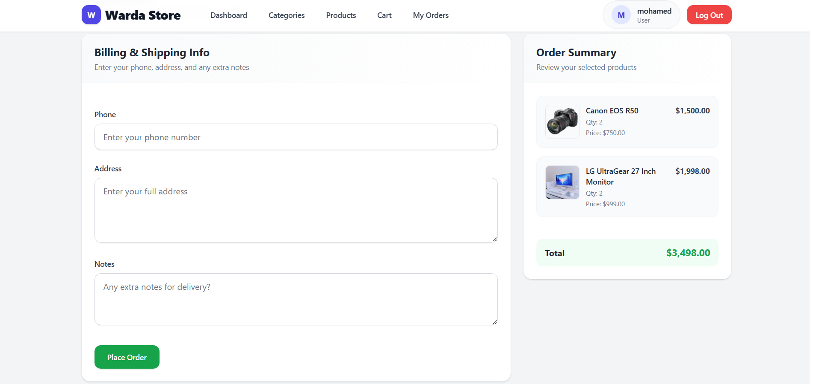
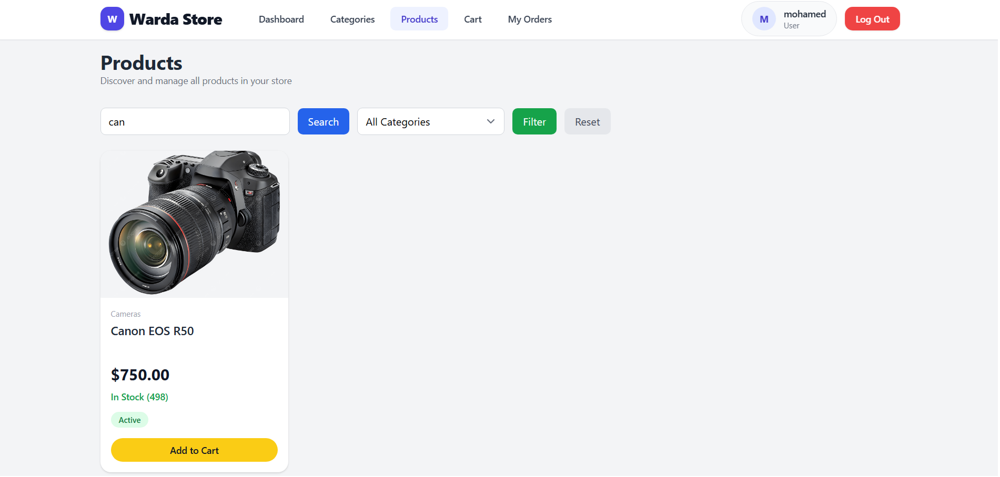
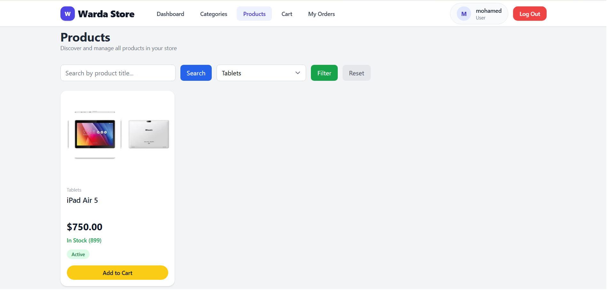
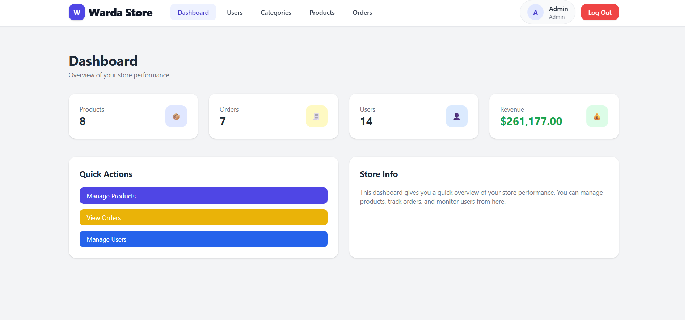
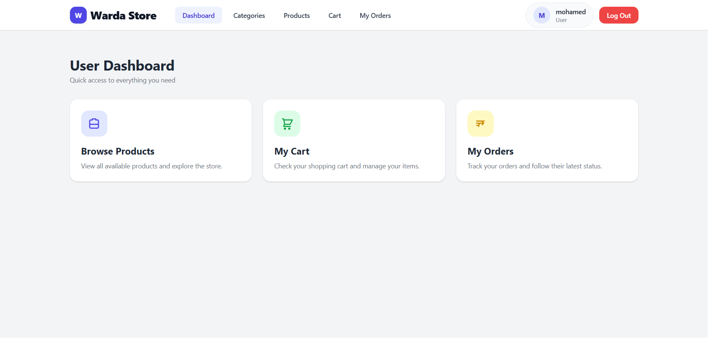
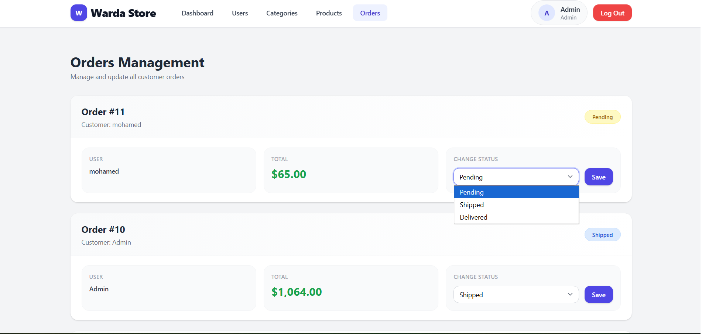
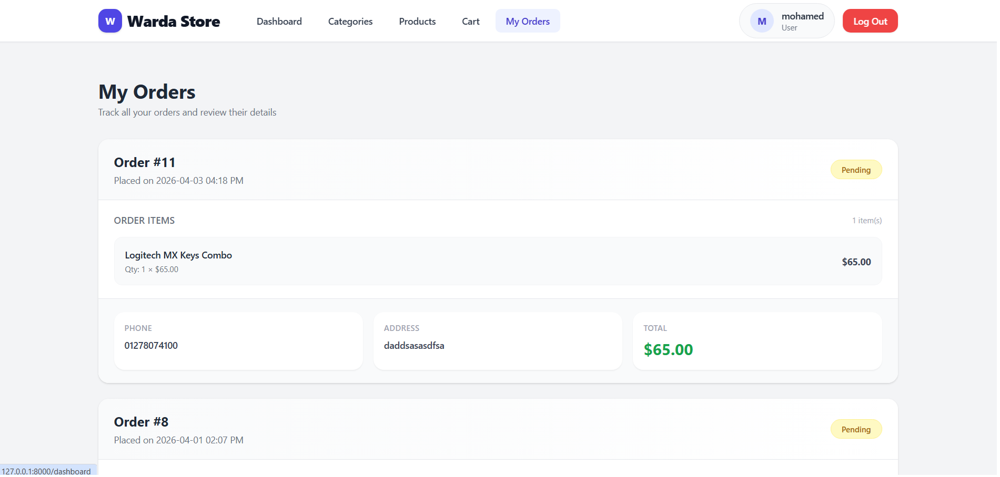

# 🛒 Laravel E-Commerce

## Features
- Products & Categories
- Cart System
- Orders & Checkout
- Admin Dashboard
- REST API
- Automated Tests

## Tech Stack
- Laravel 12
- MySQL
- Tailwind CSS
- Sanctum API

## Installation
composer install
cp .env.example .env
php artisan key:generate
php artisan migrate
npm install && npm run dev 

## Screenshots

### Products Page

### Cart Page

### Dashboard

### Products

### Products (More)

### Cart

### Checkout

### Search

### Filter

### Admin Dashboard

### User Dashboard

### Order Management

### My Orders

